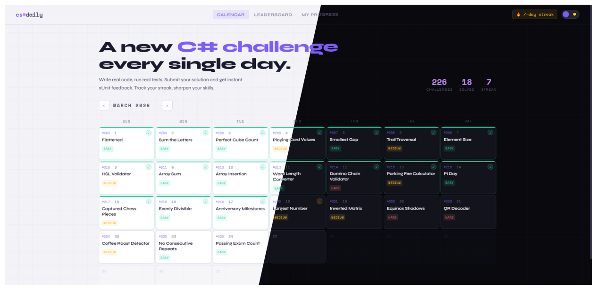

# CodeLab

Платформа с ежедневными заданиями и автоматической проверкой решений на C#.

## Демоверсия

> ⚠️ Демонстрация интерфейса (полноценного фронтенда пока нет)

## Стек технологий

| Слой    | Технологии                                                                      |
| ------- | ------------------------------------------------------------------------------- |
| Backend | .NET 9.0, Clean Architecture + DDD, Wolverine + RabbitMQ, EF Core 9, PostgreSQL |

## Документация

- [Архитектура](docs/ARCHITECTURE.md) — слои, паттерны и ключевые подходы
- [Доменная модель](docs/DOMAIN.md) — бизнес-логика, сущности и правила предметной области
- [Раннер тестов](docs/RUNNER.md) — процесс выполнения и проверки пользовательского кода
